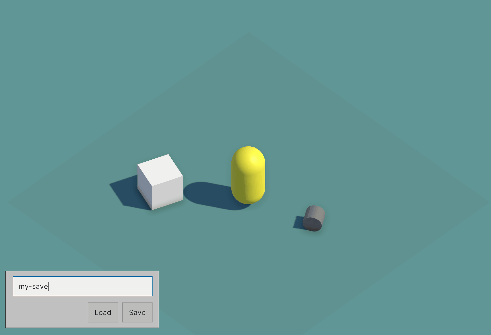

# Fab Save 

A simple, GameObject based save system for Unity.



Current features of version 0.1.0 include:
- Saving GameObject data to json.
- Loading json data and instantiating objects with the loaded data.
- Callbacks for saving and loading of custom states
- Saving references to other scene objects

# Usage

You can define how a Monobehaviours state should be saved and loaded by subscribing to the `OnLoad` and `OnSave` events of the `SaveObject` component.

````csharp
public class Item : MonoBehaviour
{
    public int cost;
    public GameObject owner;

    private void OnEnable()
    {
        // Subscribe to OnLoad and OnSave callbacks 
        // when the behaviour is enabled.
        SaveObject saveObject = GetComponent<SaveObject>();
        saveObject.OnSave += OnSave;
        saveObject.OnLoad += OnLoad;
    }

    private void OnDisable()
    {
        // Unsubscribe to OnLoad and OnSave callbacks 
        // when the behaviour is disanled so it won't 
        // be saved if it is inactive.
        SaveObject saveObject = GetComponent<SaveObject>();
        saveObject.OnSave -= OnSave;
        saveObject.OnLoad -= OnLoad;
    }

    // OnSave is called before all saved states are written to a file. 
    private void OnSave(ObjectState objectState)
    {
        // Fill the data worth saving here.
        objectState.Add("cost", cost);
        objectState.Add("owner", SaveUtils.GetGuid(owner));
    }

    // On Load is called after the all states have been loaded
    // and saved objects have been instantiated in the scene.
    private void OnLoad(ObjectState objectState)
    {
        // Retrieve and apply the loaded state here.
        cost = objectState.GetInt("cost");
        string ownerGuid = objectState.GetString("owner");
        owner = SaveUtils.FindSaveObjectByGuid(ownerGuid).gameObject
    }
}
````
